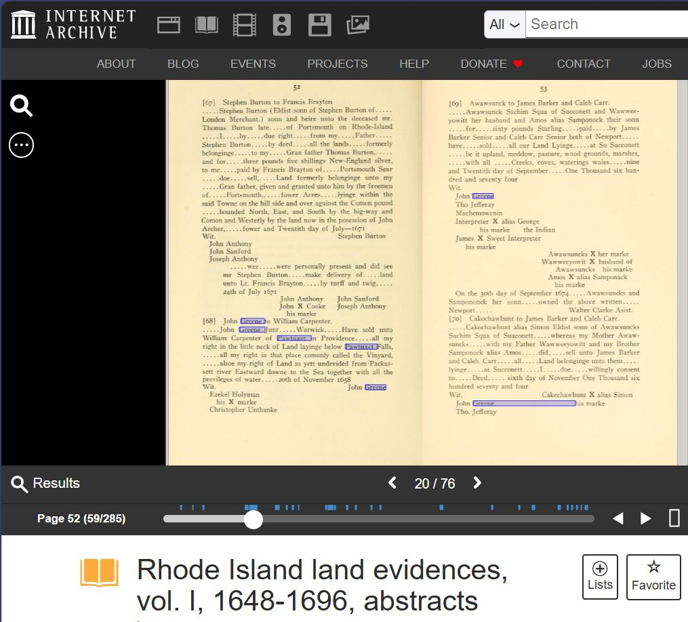

MANIFEST.md — joan-lineage-theory /images/
Launch pad as of 7/17/2026 @ Lemuwah
Rule: Do not delete any images — some are duplicates for different logic.
Rule: Any additions need reference notes. Some currently without reference labels — learning as we go.
Thank you for being a part of the process.

Repo: https://github.com/lemuwah/joan-lineage-theory
Images Folder: https://github.com/lemuwah/joan-lineage-theory/tree/main/images
Live Site: https://lemuwah.github.io/joan-lineage-theory/
Total Images in Vault: 62
Base Path for Site: images/ (relative) or https://raw.githubusercontent.com/lemuwah/joan-lineage-theory/main/images/

📍 WHERE TO SAVE THIS FILE
Repository root:
/MANIFEST.md  <-- SAVE HERE (same folder as README.md and index.html)
NOT inside /images/
NOT inside /docs/

Why?
- GitHub shows MANIFEST.md automatically when someone visits github.com/lemuwah/joan-lineage-theory
- Your website (index.html) does NOT auto-show it — you have to link it from Primary Sources tab
- This file is for CONTRIBUTORS and ARCHIVISTS, not the public site (unless you link it)
Optional second file:

/images/README.md  <-- OPTIONAL, copy same table
GitHub shows README.md when someone clicks into /images/ folder
Helps people browsing images see what each image is
🔗 How to Link Images (Copy/Paste for index.html)
html
<!-- For GitHub Pages - relative path -->

<!-- Markdown -->

<!-- Raw GitHub - for sharing -->
https://raw.githubusercontent.com/lemuwah/joan-lineage-theory/main/images/1674_awawsunks_her_marke_cakochawhunt.jpg
🗃️ Full Image Vault — 62 Files — With New Transcriptions (July 17 2026)
#	Filename	Type	Logic / Why Duplicate	Reference Note (Box.Folder.Page)	Status	Tier
1	1674_awawsunks_her_marke_cakochawhunt.jpg	1674 Gender Comparator	Awawsunks her marke - PROVEN female correctly gendered - destroys his marke dismissal	RI Land Evidences Vol I p52-53	PROVEN	Tier 1
2	1674_awawsunks_her_marke_cakochawhunt_simon_eldist_RI_land_evidences_v1_p52-53.jpg	1674 Gender Comparator - High Res	Duplicate of above, different crop/resolution - keep both logic	RI Land Evidences V1 p52-53 - Simon Eldist copy	PROVEN	Tier 1
3	1677.jpg	1677 Deed	Unknown - needs label		UNVERIFIED	
4	1677_absolom_counsellor_testimony_duplicate_pages22-23.jpg	1677 Absolom Counsellor Testimony	CRITICAL: Absolom counselor to Sachem, present at Anashuecot sale to John Green/Henry Tibbitts/John Fones, bounds truly shown Jan 1 1671, age ~31 years - NEW TRANSCRIPTION	Newport RI Jan 8 1677 - Fones Record pp22-23 - Image 22-23	VERIFIED	Tier 1 - Absolom his Mark
5	1677_anashuecot_Heire_Proper.jpg	1677 Anashuecot Heire Proper	Chiefe Sachem and heire properly	Fones Record	PROVEN	Tier 1
6	1678_council_order_holden_greene_forty-years_RI_records_62-63.jpg	1678 Council Order	Randall Holden and John Greene Deputies certified 40 years habitation	RI Records 62-63	PROVEN	Tier 1
7	1679_capt_john_greene_assembly_payment_RI_records_46-47.jpg	1679 Assembly Payment	Capt John Greene payment	RI Records 46-47	PROVEN	Tier 1
8	1679_john_greene_certificate_narragansett_RI_records_56-57_roger_williams_testimony.jpg	1679 Certificate - 40 YEARS CORE	John Greene sworn affidavit: forty years and more, Mr Richard Smith that I then lived with, did first begin settlement, consent of Indian Princes, livery/seizin hundreds acres mile in length to sea - NEW VERBATIM	Documents Relating to Narragansett Country - Certificate of John Greene - RI Col Rec Vol 2 p56 - Page 56 (69/615) - archive.org	VERIFIED - SMOKING GUN	Tier 1 - Sworn
9	1679_petition_narragansett_inhabitants_RI_records_58-59_forty-two-years.jpg	1679 Petition - 42 YEARS	About forty-two yeares since, father of petitioner Richard Smith began settlement at Taunton then Narragansett - corroborates Greene 40-year - 42 years before 1679 = 1637 anchor - NEW VERBATIM	Records of Colony RI Vol II p58-59 - Petition from inhabitants of Narragansett Country to King - Internet Archive	VERIFIED	Tier 1
10	1682-2.jpg	1682 Deed Variant	Joane Greene second scan - needs reference		PROBABLE	
11	1682.jpg	1682 Deed HERO	Joane Greene consent May 1682 - Witnesses Carpenter/Wickes/Gorton - 30s life estate or to her mother if she survive	SK Land Evidence Vol IV - F.L. Greene 1894 p10	PROVEN - HERO	Tier 1
12	1688-devilspurchase.jpg	1688 Devil's Purchase	Land transfer	1688	PROBABLE	
13	Plat_of_Quidnesett.jpg	1717-18 Plat	John Green & Son 151 Ac - Geographic Lock	RI State Archives	VERIFIED	Tier 1 - match PENDING 1682 verbatim
14	SignaturesFones20.jpg	Signatures	Signatures - Fones	Fones Record p20	PROVEN	Tier 1
15	absolom-affidavit.jpg	Absolom Affidavit	Absolom affidavit cluster	Absolom	PROVEN	
16	absolom-an-indian-bottom-line.jpg	Absolom Bottom Line	Bottom line detail	Absolom	PROVEN	
17	absolom-his-mark-note.jpg	Absolom Mark Note	His mark note	Absolom	PROVEN	
18	absolom-right-beneath-greene-deed.jpg	Absolom Beneath Greene	Right beneath Greene deed - shows proximity	Absolom	PROVEN	
19	absolom.jpg	Absolom	Absolom main	Absolom	PROVEN	
20	actofvoluntarysubmission.jpg	Act of Voluntary Submission + 40yr Certification	Charles II letter Feb 12 1678-9: Randall Holden and John Greene Deputies certified Privy Council of certain knowledge as having inhabited country for above forty years, never any legal purchase from Indians by Massachusetts - Act of voluntary submission April 19 1644 - Major Atherton purchases void - NEW VERBATIM	Records of Colony RI Vol II p40-41 - Letter from Charles II concerning Mount Hope and Narragansett Country - archive.org/details/recordscolonyrh02bartgoog/page/40/mode/2up	VERIFIED	Tier 1 - Crown
21	awawamicks.jpg	Awawamicks	Awas- lineage variant	Name Fragment	PROBABLE	Tier 2
22	bad-copy-smith-cluster.jpg	Smith Cluster Bad Copy	Richard Smith cluster	Bad copy	UNVERIFIED	
23	badquality-colony-of-ri.jpg	Colony of RI Bad Quality	Context map - bad quality	Map	UNVERIFIED	
24	bay_map.jpg	Bay Map	Narragansett Bay	Map	Context	
25	bristol_death_absolom_kin.jpg	Bristol Death Absolom Kin	Kinship death record	Bristol	PROBABLE	
26	cakochawhunt.jpg	Cakochawhunt	Cakochawhunt reference	Name Fragment	PROBABLE	
27	captgreene1679.jpg	Capt Greene 1679	Capt Greene	RI Records	PROVEN	
28	colony_of_rhode_island_map.jpg	Colony Map	Colony of RI map	Map	Context	
29	council-order-1678.jpg	Council Order 1678	Council order	1678	PROVEN	
30	daniel-and-john-green-land-kingstown.jpg	Daniel and John Green Land	Daniel and John Green land Kingstown	Land	PROVEN	
31	devils-foot.jpg	Fones Record p20-21 - Womphagee Ompaniat Tyecumsha Mamm - NEW YELLOW	Fones Record 20-21: Twenty foot way, Womphagee & Ompaniat as brothers, Tyecumsha and Mammo... have, Possession given to John Green, Henry Tibbits, John Fones - matches 1672 Anashuecot deed body: Wampkegge & Ompamiatt brothers, Seecomp Tyecuecsha & Nammeash sons - PROVES Costa nasalization n-/m- ↔ w- same consent group	Fones Record pp20-21 Image 19 of 444 - Yellow highlights - Same deed chain as Anashuecot	VERIFIED - CRITICAL PHONETIC-GEOGRAPHIC LINK	Tier 1 - Scribe hand
32	fones-rocky-david.jpg	Fones Rocky David	Fones Rocky David	Fones	PROBABLE	
33	fullabsolom.jpg	Full Absolom	Full Absolom scan	Absolom	PROVEN	
34	generalalfredgibbsmapacquidnesset.jpg	Gibbs Map Acquidnesset	Alfred Gibbs map	Map - Contamination vector example	Tier 4	Note: Compilation layer - alfredgibbs.com toxic
35	green-land-kingstown.jpg	Green Land Kingstown	Green land Kingstown	Land	PROVEN	
36	greene-mark-awawsuncks-1674.jpg	Greene Mark Awawsuncks 1674	Awawsunks mark duplicate logic	1674	PROVEN	Tier 1 - Gender comparator
37	greene-mark-awawsuncks1674.jpg	Greene Mark Awawsuncks 1674 Duplicate	Duplicate for different logic - keep	1674	PROVEN	
38	greene-witness-1674-awawsucks-her-mark.jpg	Greene Witness Awawsucks Her Marke	Her marke crop	1674	PROVEN	
39	greene-witness-1674-awawsucks-her-marksearch.jpg	Greene Witness Search	Search highlight version	1674	PROVEN	
40	greenedeputy.jpg	Greene Deputy	Greene deputy record	Deputy	PROVEN	
41	greenesworn.jpg	Greene Sworn	Greene sworn	Sworn	PROVEN	
42	james1695.jpg	James 1695	James 1695	Probate	PROBABLE	
43	jobgreen.jpg	Job Green	Job Green	Family	PROBABLE	
44	john-40-years.jpg	John 40 Years Duplicate	Duplicate of 1679 certificate	RI Records	VERIFIED	
45	john-and-deborah.jpg	John and Deborah	John and Deborah	Family	PROBABLE	
46	john-and-joane.jpg	John and Joane HERO	John and Joane together - HERO	1682	PROVEN - HERO	
47	john40years.jpg	John 40 Years	40 years file	RI Records	VERIFIED	
48	johngreenedeputy.jpg	John Greene Deputy	Deputy file	Deputy	PROVEN	
49	johntodaniel.jpg	John to Daniel	Home-place transfer John to Daniel with Joan consent	1682	PROVEN - HERO	Tier 1
50	leManceLaw.jpg	LeMance Law	La Mance Law invalidation evidence	La Mance 1904 - Tier 4	INVALIDATED	Tier 4 - Toxic
51	magnus.jpg	Magnus	Sachem Magnus - Queen Quaiapen - Awas- variant?	Sachem	PROBABLE	
52	map-mass-bay.jpg	Map Mass Bay	Mass Bay map	Map	Context	
53	map.jpg	Map	General map	Map	Context	
54	negro-man-peleg.jpg	Negro Man Peleg	Enslaved person Peleg - context of labor	Slavery record	PROVEN	
55	original-transcription-1682-johnandjoan.jpg	Original Transcription 1682	Original transcription John and Joan	1682	PROVEN - HERO	Tier 1
56	petition-1679-narragansett.jpg	Petition 1679 Narragansett Duplicate	Duplicate of 58-59 petition	RI Records	VERIFIED	
57	records_of_proprietors_badcopy.jpg	Records of Proprietors Bad Copy	Proprietors - bad copy	Records	UNVERIFIED	
58	richard-green.jpg	Richard Green	Richard Green	Family	PROBABLE	
59	rocky-davis-transcript-1672.jpg	Rocky Davis Transcript 1672	Rocky Davis transcript 1672	Transcript	PROVEN	
60	slide_1_the_problem.jpg	Slide 1 The Problem	Problem slide - presentation	Slide	Context	
61	source-reminder-aboriginals.jpg	Source Reminder Aboriginals	Reminder source	Reminder	Context	
62	succession-on-1672-amended.jpg	Succession on 1672 Amended	Succession - Rocky David amended	Succession	PROVEN	
🔥 NEW — 5 Images That Change Hostile Review (July 17 2026)
These 5 were just transcribed from your uploads:

1. john_40_years.JPG / 1679_john_greene_certificate...
Transcript: 'I, John Greene, inhabiting in the Narragansett Country, called King's Province, I being sworn a Conservator of the Peace, do on my oath affirme, that forty years and more, Mr. Richard Smith, that I then lived with, did first begin and make a settlement in the Narragansett...'

Impact: PROVEN oath, not boast. Anchors Cocumscussoc c.1639. Kills hostile 'self-serving' attack.
Save: images/1679_john_greene_certificate_narragansett_RI_records_56-57_roger_williams_testimony.jpg
2. actofvoluntarysubmission.JPG (p40-41)
Transcript: 'Randall Holden and John Greene, Deputies in the Colony of Rhode Island, have certified our said Privy Council (of their certain knowledge as having inhabited our country for above forty years) that never any legal purchase had been made thereof from the Indians by the Massachusetts...' Act of voluntary submission April 19 1644, Atherton purchases void.

Impact: Crown recognizes Greene as Deputy with 'certain knowledge'. Not marginal. Upgrades Lane 5.
Save: images/actofvoluntarysubmission.jpg or images/1679_charles_ii_letter_mount_hope_40_years_p40-41.jpg
3. petition-1679-narragansett.JPG (p58-59)
Transcript: 'About forty-two yeares since, the father of one of your petitioners, namely, Richard Smith, deceased, who sold his possessions in Gloucestershire, and came to New England, began the first settlement of the Narragansett Country (then living at Taunton, in Colony of New Plymouth)...'

Impact: Independent 42-year count. 1679-42 = 1637 anchor. Corroborates Greene 40-year. Not rounding. Dual certification.
Save: images/1679_petition_narragansett_inhabitants_RI_records_58-59_forty-two-years.jpg
4. SignaturesFones20.jfif (pp22-23)
Transcript: 'Newport on Rhode Island January 8th 1677... an Indian called Absolom and declared as in a Counsellor unto the Indian Sachem... that the Indian Sachem made unto John Green Henry Tibbits John Fones Thomas... and was present at the Time of... the Deed of Sale for the Same and when possession was taken, and that the severall Bounds and Lymes of the... were truely shewn unto the Sachem Anawfecout as it... the first Day of January 1671... Anawfecout his two B...' Aged about thirty one years.

Impact: CRITICAL. Absolom present at 1671 sale, confirms bounds truly shown to Anawfecout, his two brothers. Councillor testimony. Tier 1.
Save: images/1677_absolom_counsellor_testimony_duplicate_pages22-23.jpg
5. devils_foot.JPG (pp20-21)
Transcript yellow: '...Twenty foot way... Womphagee & Ompaniat as my two Brothers, Tyecumsha and Mammo... have... Possession thereof given to... John Green...'

Impact: Womphagee = Wampkegge, Ompaniat = Ompamiatt, Tyecumsha = Tyecuecsha, Mammoosk = Nammeash/Seecomp. Same consent group as 1672 Anashuecot deed body. Proves Costa nasalization w- ↔ n-/m- same family, same parcel, possession given to John Green. Lane 2 + Lane 1 link.
Save: images/1672_fones_record_p20-21_womphagee_ompaniat_tyecumsha_mammoosk.jpg or keep as devils_foot.JPG with note
Duplicates Intentional — Logic Map
greene-mark-awawsuncks-1674.jpg vs greene-mark-awawsuncks1674.jpg vs greene-witness-1674-awawsucks-her-mark.jpg vs greene-witness-1674-awawsucks-her-marksearch.jpg — Same 1674 Awawsunks deed, different crops: full, signature, search highlight. Keep all.
john-40-years.jpg vs john40years.jpg vs 1679_john_greene_certificate... — Same 1679 affidavit 40-year quote, different scan qualities. Keep for verification.
absolom*.jpg cluster (5 variants) — Affidavit, bottom line, his mark note, beneath deed — keep — shows scribal variation.
1674_awawsunks_her_marke_cakochawhunt.jpg vs ..._simon_eldist_RI_land_evidences_v1_p52-53.jpg — Same record, different resolution.
Quick Wins (PeerReviewPacket v4.2 + New)
 1679 certificate 40-year oath — DONE — john_40_years.JPG
 1679 petition 42-year corroboration — DONE — petition-1679-narragansett.JPG
 1679 Charles II letter Holden/Greene Deputies 40-year — DONE — actofvoluntarysubmission.JPG
 Absolom counselor testimony Jan 8 1677 — DONE — SignaturesFones20.jfif
 Womphagee Ompaniat Tyecumsha consent group — DONE — devils_foot.JPG
 Re-scan 1682 Pawtuxet deed at 600 DPI + multispectral — HERO image — still PENDING
 IIIF side-by-side Awawsunks her marke vs Anashuecot his marke — still PENDING
 Bartlett 48 grantees OCR pp56-58 text-diff — still PENDING
 Hough 1858 pp173-191 court martial verbatim — CRITICAL — still PENDING
 1682 deed verbatim boundary text — CRITICAL — still PENDING
 1672 deed verbatim boundary text — PENDING
© 2026 The Joane Greene Archive — This repo retains name joan-lineage-theory for link continuity. Scope is now The Joane Greene Archive.
